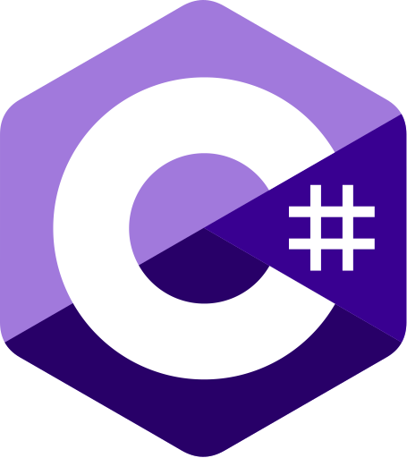
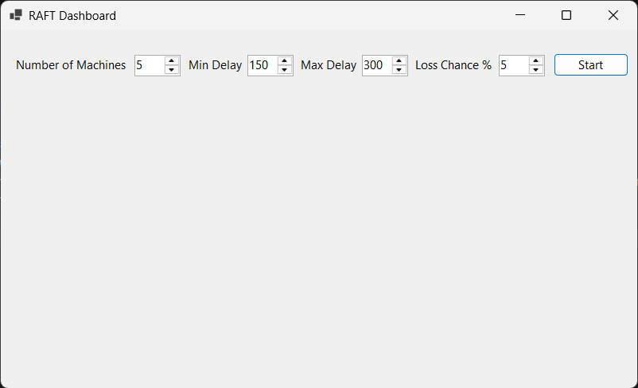
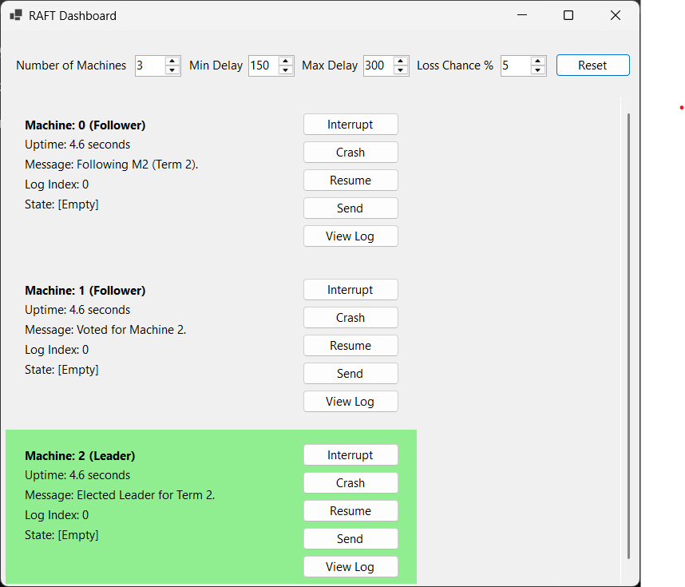
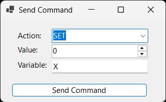
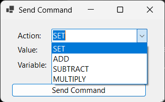
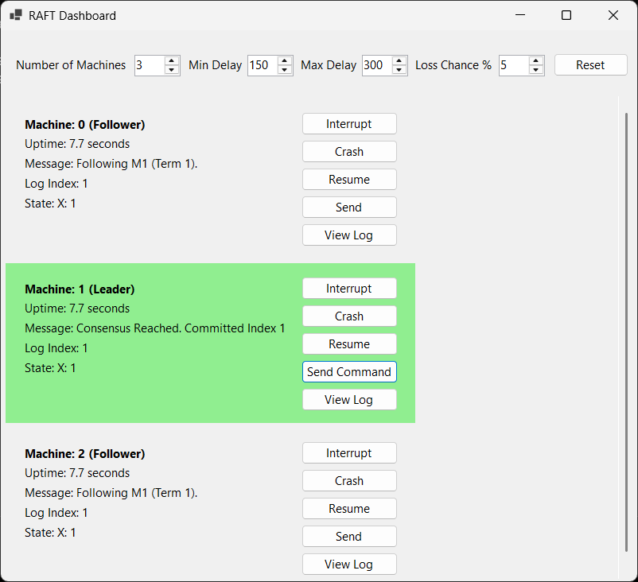
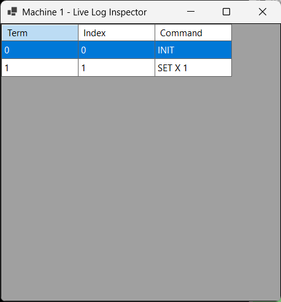

# Raft Algorithm
A method to replicate logs across servers while accounting for node failures or data loss

## Description
This project simulates an implementation of the raft algorithm by utilizing the C# Task Parallel Library (TPL). Using the TPL allows for individual threads to be created and run simultaneously in order to simulate a group of servers on just one machine. Each thread acts as one machine which performs its own task and logging while communicating with the other machines to assure all machines retain the same state. Machine crashes, interruptions, and packet loss can be perfomed on any machine to simulate real world scenarios where machines no longer are in the same state.

## Requirements

* OS: Windows 
* C# 
* .NET9

## Usage
### Opening
- Download or clone project from git repository
- Navigate in termimal from project root to inner RaftDashboard folder -> .\RaftDashboard\RaftDashboard
- Enter command -> dotnet run
### GUI
#### Starting
- GUI should open and display the following

- Number of Machines, simulated delay, and loss settings can be modified before starting
- *Note:* settings can also be changed while running but will only change when restart button is selected
- Once started GUI will appear as follows

#### Running
- Each machine has a set of buttons to its right that control that individual machine
- The send button can be slected **on the leader** to set values across all machines

- Users may change values, variables, and perform different actions
- Once a value is set it will be distributed across machines

- The View Log button can be use to see the history of messages sent between devices

